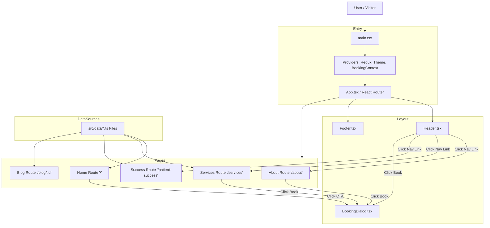

# Ortho Solution - Project Architecture

## 📂 Project Structure Map

This "tree" visualizes how the files are organized in the project and what each directory is responsible for.

```text
src/
├── main.tsx                  # 🏁 ENTRY POINT: Mounts React, Redux, Theme, & Context Providers
├── App.tsx                   # 🚦 ROUTER: Defines URL routes (/, /about, /services) & Layout
│
├── components/               # 🧱 UI BUILDING BLOCKS
│   ├── layout/               #    - Global shell components
│   │   ├── Header.tsx        #        (Navigation, Logo, Mobile Drawer)
│   │   └── Footer.tsx        #        (Links, Socials, Developer Credit)
│   │
│   ├── home/                 #    - Components specific to the Homepage
│   │   ├── HeroSection.tsx   #        (Top Image, Main CTA)
│   │   ├── Specialties.tsx   #        (Service previews on home)
│   │   ├── DoctorProfiles.tsx#        (Doctor cards)
│   │   ├── OverviewAwards.tsx#        (Awards section)
│   │   └── BlogPreview.tsx   #        (Recent articles on home)
│   │
│   └── common/               #    - Reusable utilities
│       ├── BookingDialog.tsx #        (Global Booking Popup)
│       └── SectionTitle.tsx  #        (Standardized Headers)
│
├── pages/                    # 📄 FULL PAGES (Route Destinations)
│   ├── AboutPage.tsx         #    (/about - Story, Values, Facilities)
│   ├── ServicesPage.tsx      #    (/services - Detailed Catalog)
│   ├── PatientSuccessPage.tsx#    (/patient-success - Stories & Stats)
│   └── BlogPostPage.tsx      #    (/blog/:id - Single Article Reader)
│
├── data/                     # 💾 STATIC DATA (The "Database")
│   ├── constants.ts          #    (Company Info, Nav Links, UI Text)
│   ├── services.tsx          #    (Service details, icons, descriptions)
│   ├── doctors.ts            #    (Doctor details)
│   ├── blogPosts.ts          #    (Article content)
│   └── testimonials.ts       #    (Patient reviews & stats)
│
├── context/                  # 🧠 GLOBAL STATE
│   └── BookingContext.tsx    #    (Manages "isBookingOpen" state app-wide)
│
├── themes/                   # 🎨 DESIGN SYSTEM
│   ├── theme.ts              #    (Colors, Typography, Component overrides)
│   └── AppThemeProvider.tsx  #    (Theme Provider Wrapper)
│
└── assets/                   # 🖼 MEDIA
    └── images/               #    (Static images)
```

## 🔄 Application Flow Diagram

This diagram shows how data and user navigation flow through the application.


