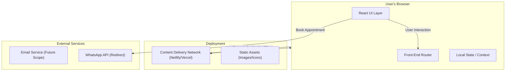
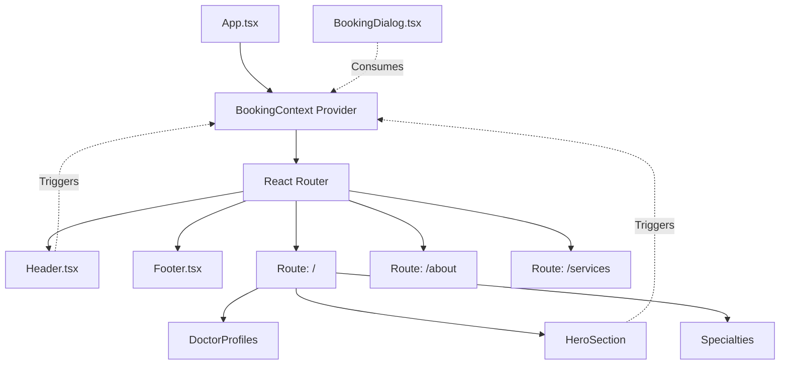
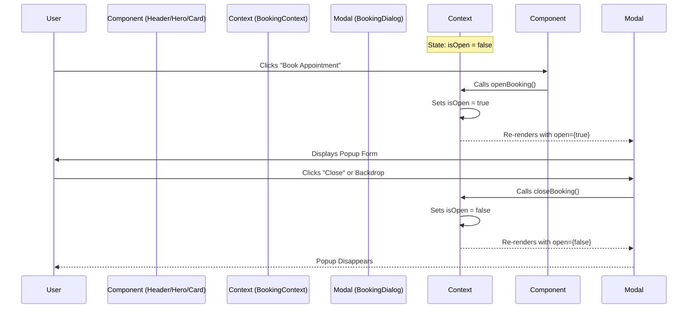

# Ortho Solution - Technical Design Documentation

This document covers the **High-Level Design (HLD)** and **Low-Level Design (LLD)** for the Ortho Solution web application.

---

## 1. High Level Design (HLD)

### System Architecture

The application follows a **Client-Side Rendering (CSR)** architecture (Single Page Application).



### 📦 Technology Stack Map

- **Presentation Layer**: React (Function Components, Hooks)
- **Styling Engine**: Material UI (Emotion CSS-in-JS)
- **State Management**: React Context (Global Booking State), Props (Local UI State)
- **Build System**: Vite (ESBuild based)

---

## 2. Low Level Design (LLD)

### 🧩 Component Hierarchy (Circuit Diagram)

This visualizes the "wiring" of the React components and how props/state flow down.



### 💾 Data Schemas (Types & Interfaces)

We use strict TypeScript interfaces to maintain data integrity.

**1. Service Interface** (Used in `services.tsx`)

```typescript
interface Service {
  title: string;
  desc: string;
  image: string; // URL for cover image
  icon: ReactNode; // MUI Icon Component
  details: {
    longDesc: string;
    conditions: string[]; // List of treated conditions
    procedures: string[]; // List of surgical procedures
  };
}
```

**2. Testimonial Interface** (Used in `testimonials.ts`)

```typescript
interface Testimonial {
  id: number;
  name: string;
  role: string; // e.g. "TKR Patient"
  image: string;
  quote: string;
  rating: number; // 1-5 Scale
  story?: string; // Optional long-form success story
}
```

### ⚡ State Flow Diagram (Booking Logic)

Detailed logic for how the global "Booking Popup" is triggered from anywhere in the app.



---

## 3. Directory & Module Organization

- **`src/components/common`**: "Atomic" components used everywhere (Buttons, Dialogs).
- **`src/components/home`**: "Molecule" components specific to the landing page.
- **`src/pages`**: "Organism" level components that represent full views.
- **`src/data`**: "Database" file that decouples content from code.
